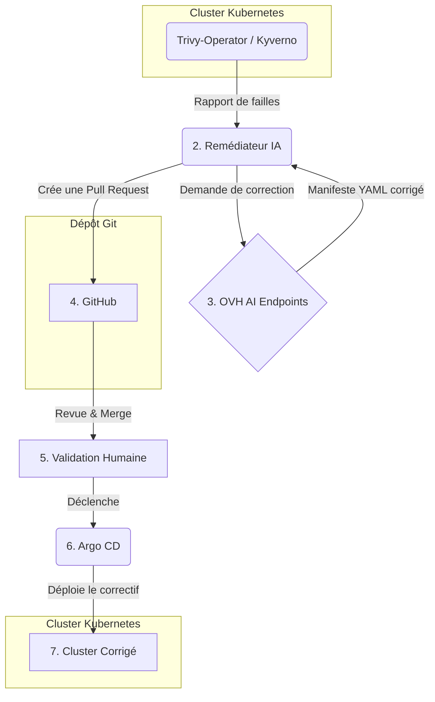

## Hackathon OVHcloud × Ynov — Projet de remédiation de sécurité assistée par IA

Ce projet met en place une chaîne DevSecOps complète et fonctionnelle sur Kubernetes, dont l'objectif est d'automatiser la correction de failles de sécurité en utilisant l'IA comme un acteur proactif de la remédiation.

### 1. Le projet est-il fonctionnel ?

**Oui, le projet est un démonstrateur entièrement fonctionnel.**

La chaîne est déployée sur un cluster Kubernetes managé OVHcloud et toutes les briques communiquent entre elles. Le scénario principal — détecter une faille, la faire corriger par une IA, valider le correctif via une Pull Request, et le déployer automatiquement — est reproductible de bout en bout.

Des scripts sont fournis pour lancer et arrêter facilement les interfaces de démonstration (Grafana, Argo CD, Falco UI, etc.).

### 2. Quel est le contexte du projet ?

Nous nous sommes projetés dans la peau d'une **équipe DevSecOps gérant une application critique** (ici, un portail patient-médecin) en production sur Kubernetes.

Dans ce contexte, la sécurité n'est pas une option. Chaque jour, de nouvelles vulnérabilités (CVE) sont découvertes dans les composants logiciels que nous utilisons. Le temps entre la détection d'une faille et son déploiement en production est une fenêtre de risque critique.

### 3. Quelle problématique avons-nous voulu aborder ?

La problématique centrale est la **lenteur et la complexité du cycle de remédiation de sécurité** dans un environnement cloud-natif.

Aujourd'hui, le processus est souvent fragmenté et manuel :
1.  Un scanner (comme Trivy) détecte une centaine de failles.
2.  Un développeur doit lire le rapport, identifier les actions à prendre (ex: mettre à jour une image, durcir un `securityContext`).
3.  Il doit ensuite écrire le code du correctif, ouvrir une Pull Request, attendre une revue...

Ce processus est lent, sujet aux erreurs et ne passe pas à l'échelle. **Le problème n'est plus la détection, mais la vitesse et la fiabilité de la correction.**

### 4. Quelle solution technique apportons-nous ?

Nous avons construit une **boucle de remédiation automatisée et contrôlée**, où l'IA devient un co-pilote actif de la sécurité.

Le flux est le suivant :

**Briques techniques clés :**
*   **GitOps (Argo CD)** : Git est la seule source de vérité. Tout déploiement passe par un `git push`.
*   **Sécurité multi-couches (Trivy, Kyverno, Falco)** : Nous scannons les images, les configurations d'infrastructure-as-code et les menaces à l'exécution.
*   **Remédiation par IA (Script `remediator` + OVH AI Endpoints)** : Notre script Python prend un rapport de sécurité, le soumet à une IA avec le manifeste actuel, et récupère une proposition de correctif.
*   **Validation "Human-in-the-loop"** : L'IA ne merge jamais automatiquement. Elle crée une Pull Request détaillée que l'équipe doit valider. C'est notre garde-fou essentiel.
*   **Déploiement sécurisé (Argo Rollouts)** : Le correctif est déployé progressivement (canary) pour s'assurer qu'il ne casse pas l'application.
*   **Observabilité complète (Prometheus, Grafana, Loki)** : Nous surveillons l'état de la sécurité et la santé de l'application en temps réel.

### 5. En quoi notre approche est-elle originale ?

L'originalité de notre projet réside dans le fait de **fermer la boucle de la remédiation**.

Là où beaucoup de projets s'arrêtent à la détection et à la génération d'alertes (`Trivy a trouvé 50 CVE critiques`), nous allons jusqu'au bout : **la proposition concrète et automatisée d'un correctif sous forme de code**.

Nous ne nous contentons pas de dire "il y a un problème", nous faisons en sorte que la machine dise : **"il y a un problème, et voici une Pull Request pour le corriger"**.

Cette approche transforme l'IA d'un simple assistant conversationnel en un véritable acteur du cycle de vie logiciel, réduisant drastiquement le temps de correction et la charge cognitive pour les équipes de développement.
